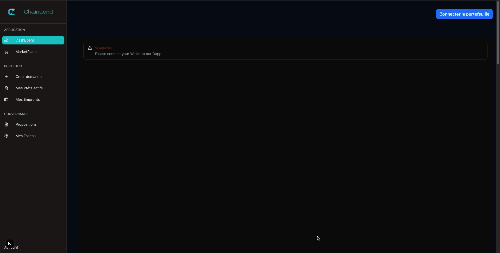

<h1 align="center">Hi 👋, I'm Joh077</h1>
<h3 align="center">A blockchain developer in transition from real estate management</h3>

- 🔭 I'm working on ChainLend, a P2P lending DApp with ETH collateral [ChainLend](https://github.com/Joh077/ChainLend) 
- 👯 I’m looking for a blockchain development job 
- 🌱 I'm currently learning advanced Solidity patterns and testing with Foundry 
- 💬 Ask me about my project, or my career transition journey 

<h3 align="left">Connect with me:</h3>

<!-- Projects -->
<h1 align="center">My latest projects 👨‍💻</h1>

  <table>
        <tr>
            <td width="100%">
                <h3 align="center">
                    <a href="https://github.com/Joh077/ChainLend" target="_blank" rel="noreferrer"> ChainLend - P2P Lending Protocol</a>
                </h3>
                

                    
                    

                        A complete decentralized peer-to-peer lending application built on Base mainnet fork, featuring ETH collateral management and CL token rewards.
                    

					

						

						<b>Note 📝</b>
						

Blockchain & Smart Contracts

- **Solidity 0.8.20** - Smart contract development with latest features
- **Hardhat** - Development environment, testing, and deployment framework
- **OpenZeppelin** - Security-audited contract libraries
- **Chainlink** - Decentralized price feeds for ETH and USDC
					

            

            </td>
        </tr>
  </table>

<h3 align="left">Languages and Tools:</h3>

              

